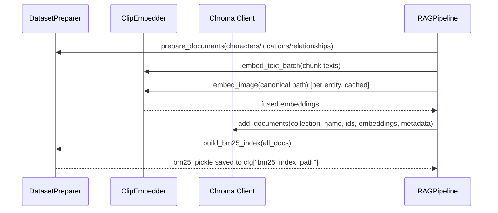

# Architecture Documentation

**Version**: 2.0  
**Last Updated**: 2025-12-02  
**Status**: Production-ready. RAG backend frozen. Prompt injection pipeline implemented via SceneConsistencyEngine.

---

## 1. System Overview

The Scene Consistency RAG System enforces continuity in anime video generation by chaining deterministic preprocessing, multimodal embeddings, hybrid retrieval, cross-encoder reranking, and prompt assembly. Every stage is instrumented with pytest suites and rich logging so downstream creative tooling receives reproducible anchors for characters, locations, and relationships.


---

## 2. Component Responsibilities

| Component | Module(s) | Responsibilities | Key Outputs |
|-----------|-----------|------------------|-------------|
| Dataset | `schemas/*.json`, `data/` | Enforce entity contracts (IDs, LoRA triggers, canonical imagery) | JSON payloads, PNG/JPEG canonical images |
| DatasetPreparer | `src/dataset/dataset_preparer.py` | Chunk entity text, tokenize for BM25, persist BM25 index | Chunk docs (`doc_id`, `bm25_tokens`), `data/bm25_index.pkl` |
| ClipEmbedder | `src/embedder/clip_embedder.py`, `backend.py`, `utils.py` | Load CLIP once, batch text/image encoding, α-fuse, L2 normalize, cache | Fused float32 vectors (`dim` = CLIP output) |
| Index Builder | `src/pipeline/rag_pipeline.py` (`build_indices`) | Embed chunks, reuse canonical image cache, upsert to Chroma, rebuild BM25 | Chroma collections per entity type |
| HybridRetriever | `src/retriever/hybrid_retriever.py` | BM25 and dense retrieval, min–max normalize, weighted fusion | `hybrid_score` candidates |
| Reranker | `src/reranker/cross_encoder_reranker.py` | CrossEncoder scoring, attach `rerank_score`, return top-K | Ordered list with rerank metadata |
| RAGPipeline | `src/pipeline/rag_pipeline.py` | Glue code exposing `build_indices` + `query`, handles fallbacks/logging | Stable API for UI/CLI/integration tests |
| SceneConsistencyEngine | `src/prompt_injection/__init__.py` | Orchestrate entity extraction, context retrieval, and shot enrichment | `EnrichedShot` JSON with RAG-enriched metadata |
| EntityExtractor | `src/prompt_injection/entity_extractor.py` | Extract character/location IDs from narrative text via regex matching | Set of entity IDs |
| ContextRetriever | `src/prompt_injection/context_retriever.py` | Query RAG for canonical descriptions using full prompt + entity filters | Retrieved context chunks per entity |
| ShotEnricher | `src/prompt_injection/shot_enricher.py` | Merge RAG context into shot metadata | `EnrichedShot` dataclass with all enriched fields |

---

## 3. Dataset → Embedder Flow

1. **Schema guarantees**  
   `docs/SCHEMA_DOCUMENTATION.md` defines strict formats for `character_id`, `location_id`, tags, metadata, and canonical resources. Validation scripts under `scripts/validate_schemas.py` enforce the contracts before ingestion.

2. **Chunking & Sparse Index**  
   `DatasetPreparer.prepare_documents`:
   - Splits appearance/description text into overlapping chunks (`chunk_size`, `chunk_overlap` from `cfg`).
   - Generates deterministic `chunk_id` / `doc_id` per entity.
   - Tokenizes with `bm25_preprocess` (lowercase, punctuation strip, stopword removal).
   - Persists both chunk metadata and BM25 tokens for later reuse.

3. **Persisted BM25**  
   `build_bm25_index` → `save_bm25_index` (pickle containing both the `BM25Okapi` instance and original documents). This snapshot is consumed by `HybridRetriever` upon instantiation to avoid repeated preprocessing.

4. **ClipEmbedder internals**  
   - `load_clip_model` (with `@lru_cache`) attempts OpenAI CLIP, falls back to OpenCLIP.
   - Text flow: `_tokenize` → `encode_text` → `l2_normalize_batch`. Results stored in `_text_cache` keyed by raw strings.
   - Image flow: `_preprocess`ed RGB tensors batched into `encode_image`. `_image_cache` keyed by absolute path; optional disk cache via joblib `Memory`.
   - Fusion: `_fuse` combines text and image embeddings using `alpha` (`fusion_alpha` config), followed by L2 normalization to keep all vectors unit length.

```startLine:endLine:src/embedder/clip_embedder.py
return l2_normalize(self.alpha * text_emb.astype(self.dtype) + (1.0 - self.alpha) * image_emb.astype(self.dtype))
```

5. **Caching strategy**  
   - **In-memory LRU**: `OrderedDict` caches for text and images with configurable `max_cache_size` (default 1000) to prevent OOM. Evicts least recently used items when full.
   - **Optional disk cache**: Controlled via `config["use_disk_cache"]`, storing numpy arrays under `data/embed_cache/`.
   - **Entity-level reuse**: `RAGPipeline._index_documents` memoizes canonical image embeddings per entity to avoid loading the same PNG/JPEG across multiple chunks.

---

## 4. Index Builder (Dense + Sparse)

`RAGPipeline.build_indices` replaces the legacy `retriever/index_builder.py`. The function orchestrates:

1. **Document preparation**  
   Calls `DatasetPreparer.prepare_documents` for characters, locations, relationships. Each doc retains `entity_id`, `chunk_index`, and tags for metadata filtering.

2. **Dense embedding + fusion**  
   - Batch text embeddings via `ClipEmbedder.embed_text_batch`.
   - Lazy image embedding reuse by entity ID (image cache dictionary).
   - `ClipEmbedder.fuse` used for backward-compatible alpha-weighted vectors.

3. **Chroma upserts**  
   `chroma_client.add_documents` receives parallel arrays of IDs, embeddings (Python lists), raw text, and metadata. Three collections are supported (`characters`, `locations`, `relationships`).

4. **BM25 rebuild**  
   Aggregated documents are passed back to `build_bm25_index` and persisted. Rebuild mode resets Chroma collections via `chroma_client.reset_collection`.



---

## 5. Retrieval Strategy

### 5.1 HybridRetriever (`src/retriever/hybrid_retriever.py`)

| Function | Description |
|----------|-------------|
| `bm25_search(query, top_k)` | Tokenizes via `DatasetPreparer.tokenize`, scores with `BM25Okapi`, returns documents with `bm25_score`. |
| `dense_search(query, collection, top_k, where)` | Embeds query text via `ClipEmbedder`, queries Chroma, maps distances to similarities (`1 - distance`). |
| `_safe_normalize(values)` | Min–max normalization with zero-range guard (`<= 1e-12`). |
| `_hybrid_fuse(bm25_results, dense_results, top_k)` | Deduplicates by `entity_id`, normalizes score vectors, applies weighted sum `dense_weight * dense + bm25_weight * sparse`, sorts, truncates. |
| `hybrid_search(...)` | Public API used by `RAGPipeline.query`. |

**Fusion math**

```
hybrid_score = dense_weight * norm_dense + bm25_weight * norm_sparse
dense_weight = 1 - cfg["bm25_weight"]
```

**Metadata filtering**

`dense_search(..., where=...)` passes through metadata filters to Chroma (e.g., `{"entity_type": "character"}`), ensuring type-correct retrieval and enabling scenario-specific subsets.

**Failure handling**

- Missing BM25 index → warning + empty sparse results.
- CLIP failures or Chroma outages → warnings + fallback to whichever modality succeeded, guarded by normalization to avoid division-by-zero.

### 5.2 Scene Consistency in Retrieval

- Canonical `entity_id` and `entity_type` tags flow from DatasetPreparer → Chroma metadata → HybridRetriever so consumers can stitch scenes using consistent IDs.
- `chunk_index` metadata enables assembling sequential text blocks for multi-shot prompts.
- Tests (`tests/test_retrieval/test_hybrid_retriever.py`) enforce deterministic ordering, candidate deduplication, and reranker-ready payloads, preventing regression-induced flicker in scene anchors.

---

## 6. Reranking & Pipeline Orchestration

### Reranker

`src/reranker/cross_encoder_reranker.py`
- Singleton `CrossEncoder` loader with rich progress spinner.
- Batch prediction via `self.model.predict(pairs, batch_size=cfg["reranker_batch_size"])`.
- Appends `rerank_score` to each candidate and trims to the requested `top_k`.

### RAGPipeline (`src/pipeline/rag_pipeline.py`)

| API | Description |
|-----|-------------|
| `build_indices(characters, locations, relationships, rebuild)` | Full dense + sparse rebuild (see Section 4). |
| `query(query_text, collection, top_k_retrieval, top_k_rerank, where)` | Runs hybrid retrieval → reranking, prints Rich tables, returns structured list. |
| `_entity_lookup` | Utility map for quick canonical metadata lookups during indexing. |
| `_display_results` | Rich table summary for CLI usage. |

**Error handling**: Empty queries short-circuit with warnings; retrieval/reranking exceptions are caught and logged, returning `[]` to callers to avoid crashing UI flows.

---

## 7. Embedding Fusion & Caching Details

| Mechanism | Location | Notes |
|-----------|----------|-------|
| Text cache | `ClipEmbedder._text_cache` | Dict keyed by raw text; `embed_text` returns reference to cached array (no copy). |
| Image cache | `ClipEmbedder._image_cache` | Dict keyed by canonical path; reused across entity chunks and retrieval queries. |
| Disk cache | Joblib `Memory` | Enabled when `joblib` is installed and `config["use_disk_cache"]` true. Stores serialized numpy arrays. |
| L2 normalization | `utils.l2_normalize` & `l2_normalize_batch` | Guard against zero vectors; `1e-12` epsilon prevents division errors. |
| Fusion | `_fuse` / `fuse` | Weighted sum of text/image embeddings, cast to `float32`, normalized again. Exposed `fuse(..., alpha=override)` for backward compatibility. |

Caching shortens repeated prompts (common during storyboard iterations) and ensures retrieval latency stays bounded even for large datasets.

---

## 8. Ensuring Scene & Character Consistency

1. **Schema-level guarantees**  
   IDs, LoRA triggers, metadata, and canonical image paths are validated pre-ingestion.

2. **Deterministic chunk IDs**  
   Chunk IDs include entity ID + zero-padded index, so reranking and prompt assembly can reference stable handles (e.g., `char_isaac_001_03`).

3. **Canonical imagery in embeddings**  
   Each entity optionally injects `canonical_image_path` during indexing, and the same caches are reused during inference. Weighted fusion keeps text and image features synchronized.

4. **Hybrid scoring**  
   Combines sparse anchors (precise keywords like "glowing katana") with dense signals (style/pose) so queries still surface the correct canonical entity even if phrasing shifts.

5. **Reranking with full text**  
   CrossEncoder sees the original chunk text, enabling context-sensitive decisions such as matching mood or relationship descriptors.

6. **ContextBuilder & PromptAssembler (downstream)**  
   Retrieved chunks feed into context anchors that include LoRA triggers, descriptive paragraphs, and canonical IDs, making final prompts self-describing and consistent.

---

## 9. Configuration & Parameters

All YAML-driven parameters currently live in `src/config/default_config.yaml`.
You can optionally create `configs/config.yaml` to override these at runtime.

| Category | Keys | Effect |
|----------|------|--------|
| Dataset | `chunk_size`, `chunk_overlap` | Controls chunk granularity and sliding window overlap in `DatasetPreparer`. |
| Embeddings | `clip_model`, `embed_cache_dir` | Influence CLIP backbone selection and on-disk cache directory. |
| Retrieval | `bm25_weight`, `top_k_retrieval` | Adjust HybridRetriever sparse vs dense weighting and default candidate count. |
| Reranking | `reranker_model`, `reranker_batch_size`, `top_k_rerank` | Determine CrossEncoder backbone, throughput, and final list size. |
| Storage | `bm25_index_path`, `chroma_store_path` | File-system locations for saved BM25 index and Chroma store. |

Additional embedder options such as `fusion_alpha`, `device`, and `use_disk_cache` are configured directly via `ClipEmbedder`'s constructor rather than via YAML.

Changing YAML values that affect indexing (e.g., `chunk_size`, `bm25_weight`, paths) requires a rebuild (`build_indices`) to keep dense and sparse stores in sync.

---

## 10. Testing & Validation References

| Test File | Coverage |
|-----------|----------|
| `tests/test_embeddings/test_clip_embedder.py` | Batch helpers, L2 normalization, caching identity, alpha overrides, quick-check CLI. |
| `tests/test_indexing/test_index_builder.py` | Dataset preparation contract, BM25 persistence, Chroma upsert invariants (even though `IndexBuilder` logic now lives in `RAGPipeline`). |
| `tests/test_retrieval/test_hybrid_retriever.py` | Sparse/dense scoring, metadata filtering, deterministic ordering, performance baselines, error fallbacks. |
| `tests/test_pipeline/test_rag_pipeline_end_to_end.py` | Integration of DatasetPreparer → HybridRetriever → reranker-ready results. |
| `tests/test_pipeline/test_prompt_builder.py` | ContextBuilder & PromptAssembler behavior and prompt assembly. |

Running `pytest -v` after modifications keeps the architecture guarantees intact.

---

## 11. Further Reading

- `README.md` — Getting started, usage examples, troubleshooting.
- `docs/SCHEMA_DOCUMENTATION.md` — Full schema specs with examples.
- `tests/README.md` — Domain-by-domain overview of the test suite and how to run subsets.

For implementation questions, start with the modules referenced above and cross-check against their corresponding pytest files listed in Section 10.
